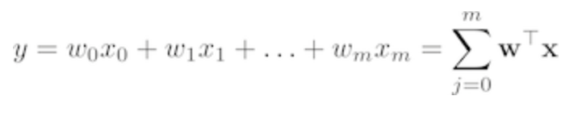

The closed-form solution may (should) be preferred for “smaller” datasets – if computing (a “costly”) matrix inverse is not a concern. For very large datasets, or datasets where the inverse of XTX may not exist (the matrix is non-invertible or singular, e.g., in case of perfect multicollinearity), the GD or SGD approaches are to be preferred. The linear function (linear regression model) is defined as:

where y is the response variable, x is an m-dimensional sample vector, and w is the weight vector (vector of coefficients). Note that w0 represents the y-axis intercept of the model and therefore x0=1. Using the closed-form solution (normal equation), we compute the weights of the model as follows:
